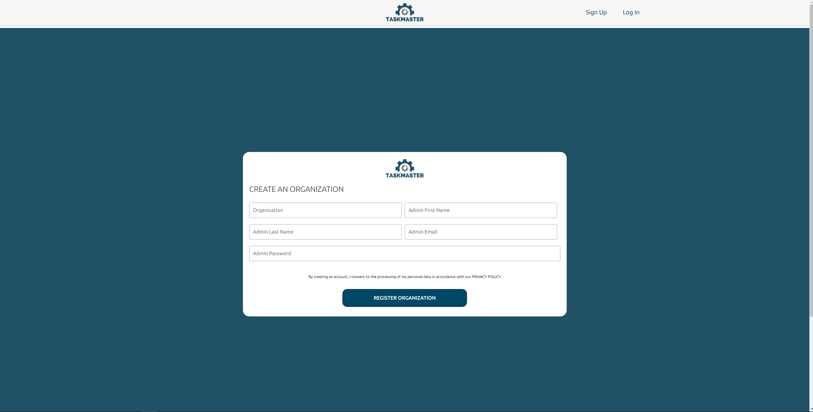
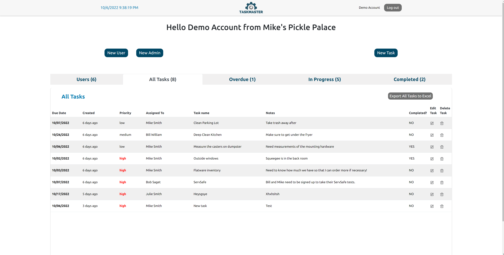
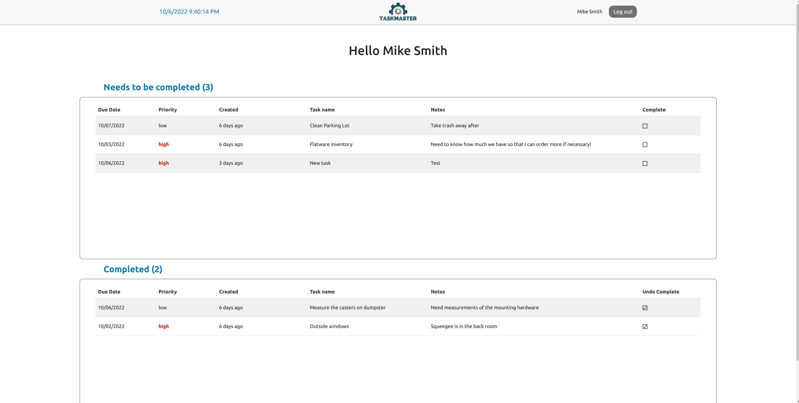

# TaskMaster
> A SAAS application for task managment using React, Node.js, Express, and MongoDB.






## Table of Contents
* [Description](#description)
* [DemoAccount](#DemoAccount)
* [Deployment](#deployment)
* [Dependencies](#dependencies)
* [Features](#features)
* [Setup](#setup)
* [Contributors](#contributors)

## Description
This web application allows employers to track and assign tasks to their users within their individual organization. Normal users can log in to track what tasks have been assigned, and check them off upon completion. 

## DemoAccount 
* ADMIN Login: user: demo@gmail.com password: Password123!
* Regular User Login: mike@gmail.com password: Password123!

## Deployment
Hosted on [Railway](https://railway.com) as a single project with two services:
* App (frontend + backend): https://taskmaster-app-production-5e8e.up.railway.app - one Node/Express service that serves the API under `/api` and the built React app from `client/build`. Deploys automatically on every push to `main`.
* Database: MongoDB (`mongo:8.0` image with a volume). The app connects to it over Railway's private network.

Railway builds with `npm run build` (installs and builds the client, installs the server) and starts with `npm start` (`node server/server.js`), both defined in the root `package.json`.

Required environment variables on the app service:
* `CONNECTION_URL` - MongoDB connection string (on Railway: `${{MongoDB.MONGO_URL}}/taskMasterUSA?authSource=admin`)
* `SECRET` - secret used to sign JWTs

> Previously hosted on AWS Amplify / Elastic Beanstalk with MongoDB Atlas, later Heroku and Cyclic. Those are gone, and the old database was not migrated.

## Security
* All API routes except login and organization sign-up require a JWT (`Authorization: Bearer <token>`), verified against the database on every request.
* Users can only access data in their own organization. Regular users see only their own record and tasks and can only mark their own tasks complete; admins can add, edit and delete users and tasks in their organization.
* Password hashes are never returned by the API.

## Dependencies
This project was created with the following:

### Backend:
* "bcrypt": "^5.0.1",
* "body-parser": "^1.20.0",
* "cors": "^2.8.5",
* "dotenv": "^16.0.1",
* "env": "^0.0.2",
* "express": "^4.18.1",
* "jsonwebtoken": "^8.5.1",
* "mongoose": "^6.4.3",
* "nodemon": "^2.0.19",
* "validator": "^13.7.0"


### Frontend:
* "@emotion/react": "^11.10.4",
* "@emotion/styled": "^11.10.4",
* "@mui/icons-material": "^5.10.6",
* "@mui/material": "^5.10.6",
* "@testing-library/jest-dom": "^5.16.5",
* "@testing-library/react": "^13.4.0",
* "@testing-library/user-event": "^13.5.0",
* "axios": "^0.27.2",
* "bootstrap": "^5.2.1",
* "date-fns": "^2.29.3",
* "react": "^18.2.0",
* "react-bootstrap": "^2.5.0",
* "react-dom": "^18.2.0",
* "react-icons": "^4.4.0",
* "react-router-dom": "^6.4.0",
* "react-scripts": "5.0.1",
* "styled-components": "^5.3.5",
* "web-vitals": "^2.1.4",
* "xlsx": "^0.18.5"

## Features
* Login as a normal user, sign an organization up, or log in as an admin level user to control functionality across the application. Logins are protected with Bcrypt, JWT tokens, and validator.
* Styled components used for design in order to have custom React components and cut down on the Javascript build file.
* Ability to export user and/or task data as an Excel file. 
* Deployed as a single Node service on Railway, where Express serves both the API and the React build.

## Setup
To clone and run this application, you'll need [Git](https://git-scm.com), [Node.js](https://nodejs.org/en/download/) 18+ (which comes with [npm](http://npmjs.com)) and a MongoDB database (local, or the Railway MongoDB service exposed through a TCP proxy).

```bash
# Clone this repository
$ git clone https://github.com/jgotti1/New-TaskMasterUSA.git

# Go into the repository
$ cd New-TaskMasterUSA

# Install dependencies in both folders
$ (cd server && npm install)
$ (cd client && npm install)
```

Create `server/.env`:

```
PORT=5001
CONNECTION_URL=mongodb://<user>:<password>@<host>:<port>/taskMasterUSA?authSource=admin
SECRET=any-local-secret
```

`5001` is used instead of `5000` because macOS reserves port 5000 for AirPlay Receiver. The client dev server proxies `/api` to `http://localhost:5001` (see `proxy` in `client/package.json`), so keep the two in sync.

Then run each in its own terminal (start the server first):

```bash
# Backend (API on localhost:5001); use `npm run dev` for auto-reload with nodemon
$ cd server && npm start

# Frontend (dev server on localhost:3000)
$ cd client && npm start
```

Open http://localhost:3000. The API is under `/api` (`/api/user`, `/api/tasks`, `/api/organizations`).

To test the production setup locally (Express serving the built client), run `npm run build` from the repository root, then `npm start`, and open http://localhost:5001.

* [John Margotti](https://github.com/jgotti1)

